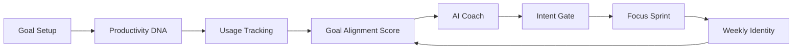

# Architecture

GoalOS AI is an **AI productivity personality OS** — a local-first monorepo with web and Android clients sharing the same product loop and scoring logic.

## High-level overview

```
┌─────────────────────────────────────────────────────────────┐
│                     GoalOS AI (Monorepo)                     │
├──────────────────────────┬──────────────────────────────────┤
│      goalos-web          │         goalos-android            │
│   Next.js + React        │   Kotlin + Jetpack Compose        │
│   localStorage           │   DataStore + UsageStatsManager     │
│   WebLLM (browser AI)    │   Rule-based CoachEngine          │
└──────────────────────────┴──────────────────────────────────┘
```

## Core product loop



1. **Goal setup** — User defines what they're building toward
2. **Productivity DNA** — Quiz derives identity, focus window, coaching tone
3. **Usage tracking** — Demo data (web) or UsageStatsManager (Android)
4. **Goal Alignment Score** — Daily 0–100 score from v1 formula
5. **AI Coach** — Context-aware chat and next-best-action
6. **Intent Gate** — Pause before distracting apps; classify intent
7. **Focus Sprint** — Timed deep-work block; boosts score
8. **Weekly identity** — Shareable progress summary

## Web architecture

```
goalos-web/src/
├── app/                 # Next.js App Router, layout, globals
├── components/
│   ├── onboarding/      # Welcome → Goal → DNA → Privacy
│   ├── dashboard/       # Today screen
│   ├── tabs/            # Goal, Coach, Insights, Profile
│   ├── layout/          # AppShell, BottomNav
│   └── ui/              # Shared cards, bubbles, score ring
├── hooks/
│   ├── useGoalOS.ts     # Central state + persistence
│   └── useWebLLM.ts     # Browser LLM loader
└── lib/
    ├── scoring.ts       # Goal Alignment Score v1
    ├── coach.ts         # Rule-based coach + chat helpers
    ├── web-llm-coach.ts # WebLLM integration
    ├── storage.ts       # localStorage
    └── types.ts         # Shared TypeScript types
```

**State flow:** `loadState()` → `useGoalOS` → `saveState()` on every persist.

**AI Coach:** WebLLM (`Llama-3.2-1B`) when WebGPU available; falls back to `coach.ts` rules.

## Android architecture

```
goalos-android/app/src/main/java/com/goalos/ai/
├── MainActivity.kt
├── GoalOSViewModel.kt       # UI state, coach messages, tabs
├── domain/
│   ├── Models.kt            # Serializable data classes
│   ├── Engines.kt           # ScoringEngine, CoachEngine
│   └── GoalOSConstants.kt
├── data/
│   ├── UserRepository.kt    # DataStore JSON persistence
│   └── UsageStatsCollector.kt
└── ui/
    ├── GoalOSApp.kt         # Scaffold + bottom nav
    ├── screens/MainScreens.kt
    ├── onboarding/
    ├── components/
    └── theme/
```

**State flow:** `UserRepository.state` (Flow) → `GoalOSViewModel` → `save()`.

## Goal Alignment Score (v1)

Shared formula across platforms:

| Component | Max points |
|-----------|------------|
| Goal-supporting time | 30 |
| Roadmap completion | 20 |
| Deep work | 15 |
| Intent match | 15 |
| Wellness balance | 10 |
| Distraction penalty | negative |
| Late-night penalty | negative |
| Context-switch penalty | negative |

**Total:** 0–100

Implementations:
- Web: `goalos-web/src/lib/scoring.ts`
- Android: `goalos-android/.../domain/Engines.kt`

## Privacy model

- **Local-first** — no backend in OSS release
- **Usage-only** — app names, durations, session counts
- **No content reading** — messages, keystrokes, photos not accessed
- **User control** — export JSON, delete all data

## CI/CD

| Workflow | Trigger | Actions |
|----------|---------|---------|
| `ci.yml` | Push/PR to `main` | Web lint+build, Android assemble |
| `release.yml` | Tag `v*.*.*` | Build artifacts, GitHub Release + APK |

See [DEPLOYMENT.md](./DEPLOYMENT.md) for hosting options.

## Future roadmap (not in OSS yet)

- Supabase auth + sync
- Server-side LLM coach API
- iOS client
- Real app blocking / focus modes
