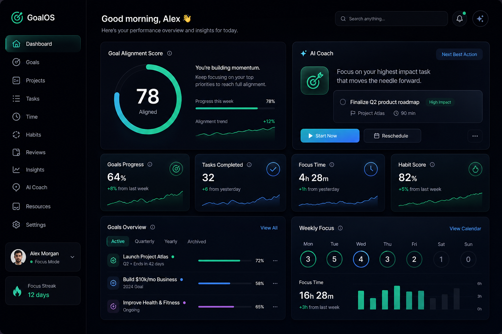

# GoalOS AI — Web

<p align="center">
  <strong>Turn screen time into goal time.</strong>
</p>

<p align="center">
  AI-powered productivity personality OS — open source web demo with premium dark-glass UI.
</p>

<p align="center">
  <a href="#quick-start">Quick Start</a> ·
  <a href="#features">Features</a> ·
  <a href="#architecture">Architecture</a> ·
  <a href="CONTRIBUTING.md">Contributing</a>
</p>

---

GoalOS AI helps you align daily screen time with your goals through scoring, coaching, intent checks, and focus sprints. This web app is a **local-first demo** — data stays in your browser. The companion [Android app](../goalos-android) adds real usage tracking via `UsageStatsManager`.

## Features

| Module | Status |
|--------|--------|
| Goal setup + Productivity DNA quiz | ✅ |
| Privacy-first onboarding | ✅ |
| Goal Alignment Score (v1 formula) | ✅ |
| Today dashboard with metrics | ✅ |
| **Interactive AI Coach chat** | ✅ |
| Intent Gate | ✅ |
| Focus Sprint timer | ✅ |
| Weekly insights + identity | ✅ |
| Privacy center (export/delete) | ✅ |
| Responsive desktop shell + phone frame | ✅ |

## Quick start

```bash
cd goalos-web
npm install
npm run dev
```

Open [http://localhost:3000](http://localhost:3000).

### Production build

```bash
npm run build
npm start
```

For [Render](https://render.com) or similar hosts, bind to `0.0.0.0:$PORT`.

## Screenshots & walkthrough

| Preview | File |
|---------|------|
| Web dashboard | `public/media/web-preview.png` |
| AI Coach | `public/media/coach-preview.png` |
| Mobile demo | `public/media/mobile-preview.png` |
| Android app | `public/media/android-preview.png` |

The [landing page](http://localhost:3000) includes an auto-playing **product walkthrough** (image reel) and screenshot gallery.

<p align="center">
  
</p>

## Architecture

```
goalos-web/
├── src/app/              # Next.js pages + global styles
├── src/components/       # UI: onboarding, dashboard, tabs, layout
├── src/hooks/            # useGoalOS state management
└── src/lib/              # Scoring engine, coach chat, storage, types
```

**Stack:** Next.js 16 · React 19 · TypeScript · Tailwind CSS v4 · lucide-react

**State:** `localStorage` (demo). No backend required.

## Goal Alignment Score

Implements the v1 product formula:

- Goal-supporting time (30 pts)
- Roadmap completion (20 pts)
- Deep work (15 pts)
- Intent match (15 pts)
- Wellness balance (10 pts)
- Distraction / late-night / context-switch penalties

See `src/lib/scoring.ts`.

## AI Coach

The coach uses **WebLLM** — a small language model that runs **entirely in your browser** via WebGPU. No API keys, no server, no Docker.

- First visit to the Coach tab downloads ~600MB (cached afterward)
- Works best in **Chrome** or **Edge** with WebGPU
- Falls back to smart rule-based replies if WebGPU is unavailable

See `src/lib/web-llm-coach.ts` and `src/lib/coach.ts`.

## Environment variables

No environment variables required for the demo.

## Monorepo

| Directory | Description |
|-----------|-------------|
| `goalos-web/` | This web app (Next.js) |
| `goalos-android/` | Native Android app (Kotlin + Compose) |

## Contributing

See the [monorepo contributing guide](../CONTRIBUTING.md). PRs welcome!

## License

[MIT](../LICENSE) — free for personal and commercial use.
